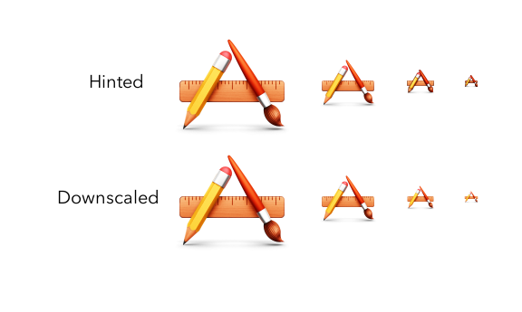
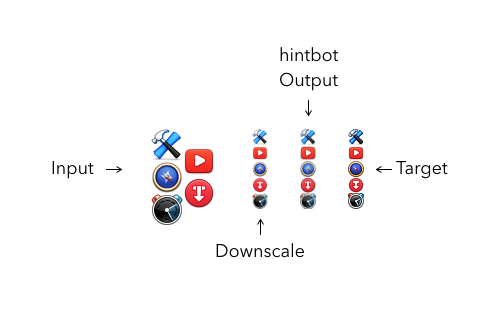

# hintbot
A CNN written in keras to hint icons automatically.  Live in-browser at [madebyollin.github.io/hintbot/](https://madebyollin.github.io/hintbot/)

**What is hinting?**

Hinting is the process of making icons crisp at small sizes.  Here's an example:

For the entire history of civilization, men and women have laboriously pushed pixels to hint their icons by hand.
But no longer!

**How well does Hintbot work?**

Here's how Hintbot performs at present (images shown are from test data; the model hadn't seen them before!):

The model output is substantially better than a standard downscale.  However, it still falls short of human performance (for now).
This is not an indicator that the human performance is unreachable–rather, it's just a sign of my own lack of experience in building models.  It probably needs more parameters, or something.

**Wait, how does it work in-browser?**

I've used [keras.js](https://github.com/transcranial/keras-js/) to do the processing client-side.  It loads and renders very quickly because the model (and size of input/output) is very small.

**Is this really an important problem?**

Not really, no!  But it takes me about 30-60 minutes to hint all of the sizes of a single icon, and it's a very mechanical process, so I'd like to have a robot do it.  My hope is that tackling simple problems like this first will help me develop the experience to tackle larger ones.
